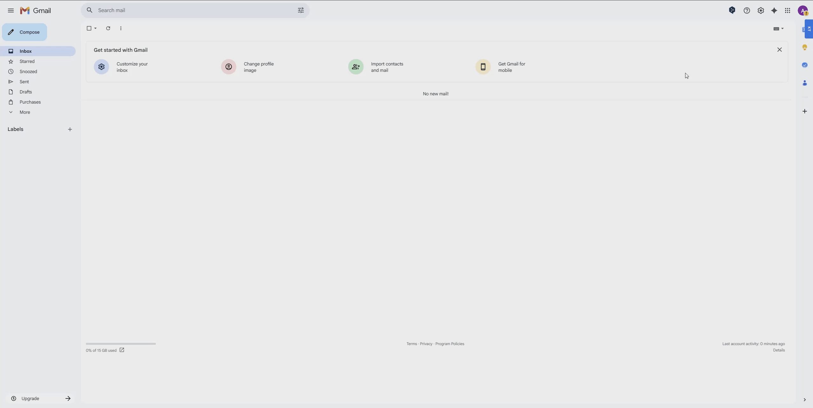

# Keeptouch

> Gmail sidebar showing people you haven't emailed in a while.



## Features

- Sidebar slides in from the right inside Gmail
- Scans your Sent folder and shows contacts silent for ≥ 30 days
- One-click compose to any contact
- Hourly background refresh via Chrome Alarms API
- OAuth2 via `chrome.identity` — no server required

## Setup

### 1. Google Cloud project

1. Go to [console.cloud.google.com](https://console.cloud.google.com)
2. Create a new project (e.g. "Keeptouch")
3. Enable **Gmail API**
4. Go to **APIs & Services → Credentials → Create Credentials → OAuth 2.0 Client ID**
5. Application type: **Chrome Extension**
6. Load the extension in `chrome://extensions` first (Developer mode), copy the **Extension ID**
7. Paste the Extension ID into the OAuth client
8. Copy the **Client ID**

### 2. Configure the extension

Open `manifest.json` and replace:
```json
"client_id": "YOUR_GOOGLE_OAUTH_CLIENT_ID.apps.googleusercontent.com"
```

### 3. Load in Chrome

1. Open `chrome://extensions`
2. Enable **Developer mode**
3. Click **Load unpacked** → select the `keeptouch/` folder
4. Open Gmail — the "KT" toggle appears on the right edge

## Configuration

| Constant | File | Default | Effect |
|---|---|---|---|
| `DAYS_THRESHOLD` | `sidebar.js` | 30 | Days of silence before showing a contact |
| `REFRESH_INTERVAL_MINUTES` | `service_worker.js` | 60 | How often to re-scan Sent |
| `limit` | `gmail.js` getSentContacts | 200 | How many sent messages to scan |

## Architecture

```
Chrome Identity API (OAuth2)
        │
        ▼
service_worker.js  ──alarm──►  gmail.js  ──►  chrome.storage.local
        │
   chrome.runtime.sendMessage
        │
        ▼
inject.js (content script on mail.google.com)
        │
   postMessage (cross-origin iframe)
        │
        ▼
sidebar.html / sidebar.js  (rendered in extension origin)
```

## Security

**Data collected:** email addresses and last-contacted dates only. No message bodies, subjects, or attachments are ever fetched — the Gmail API is called with `format=metadata`.

**Token handling:** OAuth2 tokens are managed exclusively by `chrome.identity` and never written to `chrome.storage`. Chrome handles token caching and silent refresh internally.

**postMessage hardening:** the sidebar runs in a `chrome-extension://` iframe embedded in Gmail. All `postMessage` calls are scoped to explicit origins (`chrome.runtime.getURL("")` and `https://mail.google.com`) so neither Gmail's page nor any third-party site can inject or intercept messages.

**No backend:** all data stays on the user's machine in `chrome.storage.local`, isolated to this extension's origin.

## Permissions

| Permission | Reason |
|---|---|
| `identity` | OAuth2 token via `chrome.identity` |
| `storage` | Cache contacts locally |
| `alarms` | Hourly background refresh |
| `https://mail.google.com/*` | Inject sidebar into Gmail |
| `https://www.googleapis.com/*` | Call Gmail REST API |
| `gmail.readonly` | Read sent messages (no write) |
| `contacts.readonly` | Optional: enrich names from Google Contacts |
